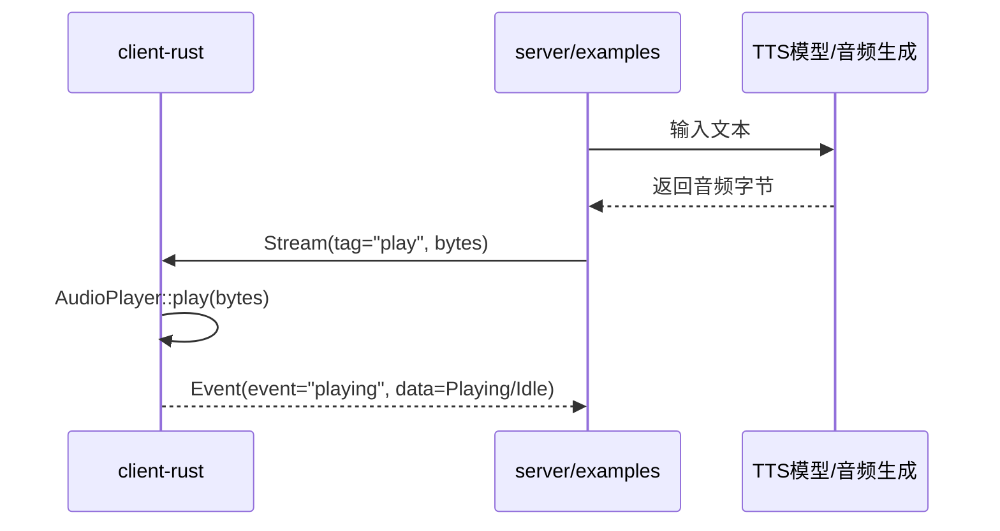
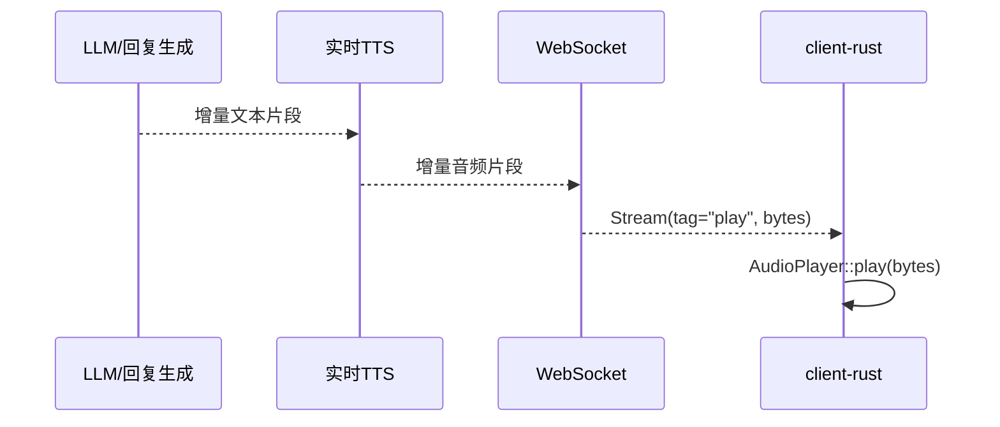

# 小爱同学自定义 TTS / 实时 TTS 接入分析

## 1. 先看结论

如果目标是把当前“小爱同学”的声音切换成：

- 自定义 TTS 模型
- 实时 TTS 模型

当前仓库里最合适的主链路都不是直接改 `Speak` / `SpeakStream`，而是：

1. 服务端生成音频
2. 通过 WebSocket 二进制 `Stream(tag="play")` 把音频字节推给客户端
3. `packages/client-rust` 中的 `AudioPlayer` 负责实际播放

这是因为：

- `Speak` / `SpeakStream` 在当前协议里是“文本播报语义事件”，告诉系统“要说什么”
- 真正让设备出声的音频链路是 `play` 二进制流
- 仓库现有样例已经多次证明，服务端可以直接把音频字节通过 `send_stream("play", bytes, None)` 回推给客户端

如果只是想低成本替换设备侧的播报方式，也可以走另一条链路：

1. 继续调用设备本地播报入口
2. 替换 `/usr/sbin/tts_play.sh`
3. 或改成 `play_url` 播放外部音频地址

但这条路线更偏“沿用设备原生能力”，不是最优的自定义语音主方案。

## 2. 当前声音是怎么出来的

### 2.1 当前协议里的关键对象

`packages/client-rust/src/services/connect/data.rs` 定义了 4 个顶层消息类型：`Request`、`Response`、`Event`、`Stream`。其中和语音输出最相关的是：

- `Event`
  - 文本事件
  - 当前会承载 `instruction`、`playing`、`kws`
- `Stream`
  - 二进制流
  - 关键字段是 `tag` 与 `bytes`
  - 其中 `tag="play"` 表示播放音频流

事实依据：

- `packages/client-rust/src/services/connect/data.rs:5`
- `packages/client-rust/src/services/connect/data.rs:14`
- `packages/client-rust/src/services/connect/data.rs:33`

### 2.2 `Speak` / `SpeakStream` 是什么

根据 `server/INTERACTION_PROTOCOL.md`，`instruction` 事件内已经整理出多种已知指令类型，其中和播报有关的主要有：

- `Speak`
  - 一次性完整播报文本
- `SpeakStream`
  - 分段播报文本
- `FinishSpeakStream`
  - 播报文本分段结束
- `playing`
  - 播放状态变化事件，如 `Playing`、`Idle`

这组事件非常重要，但它们的本质是“播报语义”或“播放状态”，不是音频字节本身。

可以把它们理解成：

- `Speak` / `SpeakStream`：告诉系统“该说什么”
- `play` stream：真正把“声音数据”送到设备上播放

### 2.3 客户端真正的播放入口

`packages/client-rust/src/bin/client.rs` 里，WebSocket 收到 `Stream` 后会进入 `on_stream`；只有当 `tag == "play"` 时，才会调用 `AudioPlayer::play(bytes)`。

代码依据：

- `packages/client-rust/src/bin/client.rs:163`
- `packages/client-rust/src/bin/client.rs:165`
- `packages/client-rust/src/bin/client.rs:167`

这说明当前真实的出声链路是：



### 2.4 客户端播放能力的边界

`AudioPlayer` 当前使用 `aplay` 播放 raw PCM 数据，播放参数来自 `AudioConfig`。

代码依据：

- `packages/client-rust/src/services/audio/play.rs:59`
- `packages/client-rust/src/services/audio/play.rs:67`
- `packages/client-rust/src/services/audio/play.rs:111`
- `packages/client-rust/src/services/audio/config.rs:15`

当前默认音频参数为：

| 字段 | 当前值 |
| --- | --- |
| `channels` | `1` |
| `bits_per_sample` | `16` |
| `sample_rate` | `16000` |
| `period_size` | `160` |
| `buffer_size` | `480` |

这意味着后续接入自定义 TTS 或实时 TTS 时，至少要关注：

- 模型输出是不是 PCM
- 采样率是不是兼容
- 声道数和位深是否匹配
- 是否需要在服务端做转码或重采样

### 2.5 客户端还有一条“设备本地播报”链路

`packages/client-rust/src/services/speaker.rs` 暴露了两个和播报直接相关的入口：

- `play_text(text)`
  - 调用 `/usr/sbin/tts_play.sh`
- `play_url(url)`
  - 调用 `ubus call mediaplayer player_play_url`

代码依据：

- `packages/client-rust/src/services/speaker.rs:81`
- `packages/client-rust/src/services/speaker.rs:83`
- `packages/client-rust/src/services/speaker.rs:91`
- `packages/client-rust/src/services/speaker.rs:93`

所以当前仓库里，实际存在两条让设备发声的路线：

| 路线 | 入口 | 本质 |
| --- | --- | --- |
| WebSocket 音频流播放 | `Stream(tag="play") -> AudioPlayer` | 服务端推音频 |
| 设备本地播报 | `play_text` / `play_url` | 设备端自己播 |

## 3. 当前仓库已经证明了“服务端推音频到客户端”可行

这不是理论推测，仓库里的样例已经把这条路走通了。

### 3.1 Node 样例

`examples/migpt/src/lib.rs` 中，`on_output_data(bytes)` 会直接执行：

```rust
MessageManager::instance()
    .send_stream("play", bytes, None)
```

代码依据：

- `examples/migpt/src/lib.rs:33`
- `examples/migpt/src/lib.rs:35`
- `examples/migpt/src/lib.rs:36`

### 3.2 Python 样例

`examples/gemini/src/lib.rs` 和 `examples/xiaozhi/src/lib.rs` 也都提供了 `on_output_data`，并把音频字节通过 `send_stream("play", bytes, None)` 推回客户端。

代码依据：

- `examples/gemini/src/lib.rs:10`
- `examples/gemini/src/lib.rs:14`
- `examples/gemini/src/lib.rs:15`
- `examples/xiaozhi/src/lib.rs:12`
- `examples/xiaozhi/src/lib.rs:16`
- `examples/xiaozhi/src/lib.rs:17`

结论很明确：

- 当前架构已经支持“服务端产音频，客户端直接播放”
- 自定义 TTS 与实时 TTS 都可以优先挂在这条链路上

## 4. 自定义 TTS 模型应该改哪些链路

这里的“自定义 TTS”指整句文本先生成完整音频，再播放。

### 4.1 推荐改造位置

推荐把自定义 TTS 放在服务端回答生成之后、音频发送之前：


### 4.2 需要修改的链路

#### 链路 1：回答文本到 TTS 音频

需要在服务端“已经得到最终播报文本”的位置增加一层 TTS 适配器：

- 输入：最终回复文本
- 输出：可播放音频字节

这里本质上是新增一个“文本 -> 音频”的能力层，不应该直接把 `Speak` 事件当成音频播放实现。

#### 链路 2：音频格式适配

由于客户端默认播放器是 raw PCM + `aplay`，所以需要确保服务端输出的音频最终符合客户端播放格式，至少要处理：

- 编码格式
- 采样率
- 位深
- 声道数

如果模型原生输出是 MP3、WAV、Opus、24kHz PCM、双声道 PCM 等，都需要在服务端统一转成客户端可接受格式，或者在播放前通过 `start_play` 切换配置。

代码依据：

- `packages/client-rust/src/bin/client.rs:114`
- `packages/client-rust/src/bin/client.rs:118`
- `packages/client-rust/src/services/audio/config.rs:15`
- `packages/client-rust/src/services/audio/play.rs:67`

#### 链路 3：服务端推送音频

这部分优先复用已有的 `send_stream("play", bytes, None)`，不需要重新设计一个新的音频事件协议。

这是当前仓库已经存在的事实链路，改造最小。

#### 链路 4：播放控制

如果切入自定义 TTS，还要一起考虑：

- 播放开始前是否要显式调用 `start_play`
- 新回答到来时是否要 `stop_play`
- 打断时是否停止旧音频
- 播放结束后是否依赖 `playing -> Idle` 做状态回收

### 4.3 对应要改的模块

如果后续要真正实现，通常需要改的是这几层：

| 模块层 | 需要做什么 |
| --- | --- |
| 服务端回答编排层 | 在生成最终文本后接入 TTS |
| TTS 适配层 | 对接具体自定义模型 API / SDK |
| 音频格式层 | 转成 `client-rust` 可播格式 |
| WebSocket 发送层 | 复用 `play` stream 推送音频 |
| 播放控制层 | 处理 `start_play` / `stop_play` / 打断 |

### 4.4 事实依据与代码依据

事实依据：

- 当前协议中，`Speak` / `SpeakStream` 是文本类播报事件
- 当前客户端真正播放音频依赖 `play` 流
- 当前样例已经证明服务端可以把音频回推到客户端

代码依据：

- `packages/client-rust/src/bin/client.rs:163`
- `packages/client-rust/src/bin/client.rs:165`
- `packages/client-rust/src/bin/client.rs:167`
- `examples/migpt/src/lib.rs:35`
- `examples/migpt/src/lib.rs:36`
- `examples/gemini/src/lib.rs:14`
- `examples/gemini/src/lib.rs:15`

### 4.5 可行性评估

可行性：高

原因：

- 已有事实链路，无需发明新协议
- 已有客户端播放实现，无需先改设备系统层
- 主要工作集中在服务端 TTS 接入和音频格式统一

主要风险：

- 模型输出格式与 `AudioPlayer` 不兼容
- 音频过大时首包延迟高
- 播放打断策略需要补齐

## 5. 实时 TTS 模型应该改哪些链路

这里的“实时 TTS”指文本边生成、音频边合成、边发送、边播放。

### 5.1 它和普通自定义 TTS 的区别

普通自定义 TTS：

1. 先拿到完整文本
2. 再一次性合成完整音频
3. 再统一发送给客户端

实时 TTS：

1. 服务端拿到增量文本
2. 增量文本持续送给 TTS
3. TTS 连续返回音频分片
4. 服务端持续推送 `play` 音频分片
5. 客户端持续写入播放器

### 5.2 推荐接入位置

实时 TTS 最适合挂在“服务端流式文本输出”之后，而不是直接依赖 `SpeakStream` 事件本身。

推荐理解方式是：

- `SpeakStream` 是文本层事实
- 实时 TTS 是音频层实现
- `play` stream 是音频层传输

即：



### 5.3 需要修改的链路

#### 链路 1：增量文本来源

需要确认服务端哪里能拿到持续输出的文本片段。理论上可以来自：

- LLM 流式输出
- 模板回答的分段输出
- 已有 `SpeakStream` 生成阶段

但实现上更推荐从“服务端文本生成源头”接入，而不是从协议事件回读文本再二次处理。

#### 链路 2：实时 TTS 音频分片输出

需要一个能持续吐出音频 chunk 的适配器。它要负责：

- 文本分片拼接或限长
- 调用实时 TTS
- 产出连续音频 chunk

#### 链路 3：`play` 流持续发送

实时 TTS 不需要新的协议类型，依然优先复用：

```text
send_stream("play", bytes, None)
```

变化只在于：

- 发送次数更多
- 每次发送的数据块更小
- 更依赖节奏稳定性

#### 链路 4：客户端缓冲与连续播放

`AudioPlayer` 当前内部是一个 channel + `aplay` stdin 写入模型，天然适合“连续喂音频块”的模式。

代码依据：

- `packages/client-rust/src/services/audio/play.rs:91`
- `packages/client-rust/src/services/audio/play.rs:94`
- `packages/client-rust/src/services/audio/play.rs:95`
- `packages/client-rust/src/services/audio/play.rs:98`

但实时 TTS 仍需重点评估：

- chunk 太小会不会造成卡顿
- chunk 间隔不稳定会不会断音
- 打断时旧 chunk 是否还在队列里
- 结束时是否需要显式 stop 或 flush

#### 链路 5：打断控制

实时 TTS 比普通 TTS 更依赖播放控制。至少要定义：

- 新一轮对话开始时如何停止旧播放
- 用户打断时是否立即清空播放器
- 服务端停止生成后如何通知完成
- `playing` 状态是否参与上层状态机切换

### 5.4 事实依据与代码依据

事实依据：

- 当前客户端已经能连续接收 `play` 流并写入播放器
- 当前样例已经支持服务端回推音频 bytes
- 当前协议里已有 `SpeakStream` 和 `playing`，说明系统本身存在“流式播报语义”和“播放状态回报”的概念

代码依据：

- `packages/client-rust/src/bin/client.rs:82`
- `packages/client-rust/src/bin/client.rs:85`
- `packages/client-rust/src/bin/client.rs:163`
- `packages/client-rust/src/services/audio/play.rs:91`
- `packages/client-rust/src/services/audio/play.rs:94`
- `examples/gemini/src/lib.rs:14`
- `examples/xiaozhi/src/lib.rs:16`

### 5.5 可行性评估

可行性：中高

原因：

- 基础音频流推送能力已经存在
- 客户端连续写入播放的机制也已经存在
- 主要新增复杂度在服务端流控与时延控制

比普通自定义 TTS 多出的风险：

- 首包延迟和 chunk 抖动
- 分片边界不自然导致听感差
- 中断后残留音频继续播放
- 播放状态和上层对话状态不一致

## 6. 如果继续走设备本地播报，需要改哪些链路

这是一条可行但不推荐作为主方案的路线。

### 6.1 设备本地 TTS 替换

如果继续沿用：

```text
SpeakerManager::play_text -> /usr/sbin/tts_play.sh
```

那么可以从两个方向替换：

1. 直接替换 `tts_play.sh` 的内部实现
2. 让 `tts_play.sh` 改为调用你的自定义 TTS 服务

优点：

- 对现有业务链路侵入小
- 设备侧逻辑保持原样

缺点：

- 受设备环境限制更强
- 对实时 TTS 支持通常较差
- 可观测性和调试性不如服务端主导链路

### 6.2 URL 音频播放

如果模型先生成一个音频文件或可访问 URL，也可以继续沿用：

```text
SpeakerManager::play_url -> ubus mediaplayer
```

这适合：

- 非实时 TTS
- 先合成完整文件再播放

但不适合高实时、低延迟的流式播报。

### 6.3 事实依据与代码依据

代码依据：

- `packages/client-rust/src/services/speaker.rs:81`
- `packages/client-rust/src/services/speaker.rs:83`
- `packages/client-rust/src/services/speaker.rs:91`
- `packages/client-rust/src/services/speaker.rs:93`

### 6.4 可行性评估

可行性：中

优点：

- 改造成本最低
- 可以快速验证“是否能换声音”

缺点：

- 对设备依赖最高
- 可控性最低
- 不适合做真正的实时 TTS 主链路

## 7. 三条路线对比

| 方案 | 改造成本 | 声音可控性 | 实时性 | 对设备依赖 | 推荐度 |
| --- | --- | --- | --- | --- | --- |
| 服务端自定义 TTS + `play` 流 | 中 | 高 | 中 | 低 | 高 |
| 服务端实时 TTS + `play` 流 | 中高 | 高 | 高 | 低 | 高 |
| 设备本地 `tts_play.sh` / `play_url` | 低 | 中低 | 低到中 | 高 | 中 |

推荐顺序：

1. 如果要“真正切换成自己的声音”，优先选服务端自定义 TTS + `play` 流
2. 如果要“边生成边说”，优先选服务端实时 TTS + `play` 流
3. 如果只想快速替换设备播报能力，再考虑 `tts_play.sh` / `play_url`

## 8. 实施建议

### 8.1 最稳妥的第一阶段

第一阶段建议先做“非实时自定义 TTS”：

1. 服务端生成最终回复文本
2. 对接自定义 TTS 模型
3. 输出统一 PCM 格式
4. `send_stream("play", bytes, None)` 回推客户端
5. 用现有 `AudioPlayer` 播放

原因是这条路：

- 风险最低
- 证据最充分
- 后续最容易平滑升级成实时 TTS

### 8.2 第二阶段再做实时 TTS

当整句 TTS 跑通后，再补：

- 增量文本输入
- 分片音频输出
- 打断控制
- 状态同步

这样可以把“声音切换”和“实时化”两个问题拆开，降低复杂度。

## 9. 事实依据总表

| 结论 | 事实依据 | 代码依据 |
| --- | --- | --- |
| 协议顶层包含 `Event` 与 `Stream` | 当前交互协议和客户端消息模型一致 | `packages/client-rust/src/services/connect/data.rs:5`, `packages/client-rust/src/services/connect/data.rs:14`, `packages/client-rust/src/services/connect/data.rs:33` |
| 真正的音频播放入口是 `tag="play"` | 客户端收到 `play` 流后才调用播放器 | `packages/client-rust/src/bin/client.rs:163`, `packages/client-rust/src/bin/client.rs:165`, `packages/client-rust/src/bin/client.rs:167` |
| 客户端播放依赖 raw PCM + `aplay` | 播放器启动参数明确要求位深、采样率、声道 | `packages/client-rust/src/services/audio/play.rs:67`, `packages/client-rust/src/services/audio/play.rs:73`, `packages/client-rust/src/services/audio/play.rs:75`, `packages/client-rust/src/services/audio/play.rs:77` |
| 默认播放格式是 16k/16bit/单声道 | `AudioConfig` 已给默认值 | `packages/client-rust/src/services/audio/config.rs:15` |
| 仓库现有样例已支持服务端回推音频 | `send_stream("play", bytes, None)` 已在多个样例使用 | `examples/migpt/src/lib.rs:35`, `examples/migpt/src/lib.rs:36`, `examples/gemini/src/lib.rs:14`, `examples/gemini/src/lib.rs:15`, `examples/xiaozhi/src/lib.rs:16`, `examples/xiaozhi/src/lib.rs:17` |
| 设备本地播报入口真实存在 | `play_text` 和 `play_url` 分别调用设备脚本与 `ubus` | `packages/client-rust/src/services/speaker.rs:81`, `packages/client-rust/src/services/speaker.rs:83`, `packages/client-rust/src/services/speaker.rs:91`, `packages/client-rust/src/services/speaker.rs:93` |
| `Speak` / `SpeakStream` 更偏文本播报语义 | 协议文档中它们被归入 `instruction` 指令类型，而不是 `Stream(play)` 音频流 | `server/INTERACTION_PROTOCOL.md` |

## 10. 最终判断

如果目标是：

- 更换成自定义声音
- 接入自己的 TTS 模型
- 接入实时 TTS 模型

当前仓库最值得改的主链路是：

```text
服务端文本 -> TTS模型 -> 音频格式适配 -> Stream(tag="play") -> client-rust AudioPlayer
```

而不是把主要改造点放在：

- `Speak` / `SpeakStream` 本身
- 设备本地 `tts_play.sh` 本身

原因很简单：

- `Speak` / `SpeakStream` 更像文本语义层
- `play` 流才是现有仓库里真正的音频传输层
- 这条链路已经被当前客户端和多个样例共同验证，可行性最高
